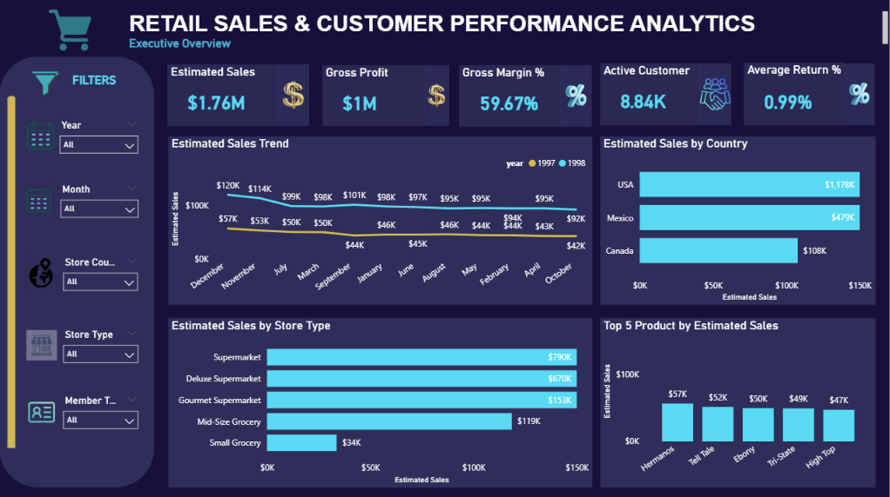
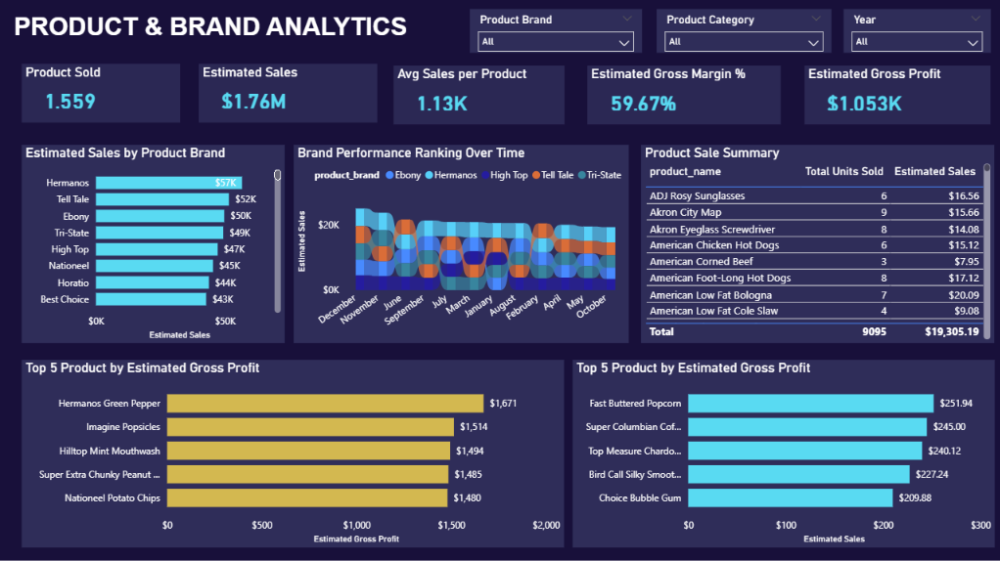
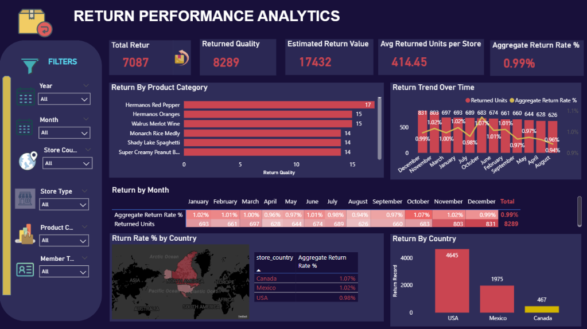

# Retail Sales & Customer Performance Analytics

> End-to-end Retail Analytics and Business Intelligence project using
> **MySQL, SQL, Power BI, and DAX** to transform 269K+ sales records
> into an analytical data model, interactive dashboards, business
> insights, and actionable recommendations.

## Project Overview

The **Retail Sales & Customer Performance Analytics** project provides a
multi-store retail business with a consolidated view of sales,
customers, products, stores, geography, estimated profitability, and
returns.

The project covers the complete analytics lifecycle:

**Raw Data → Database Setup → Data Exploration → Data Quality Assessment
→ Data Cleaning → Data Transformation → Star Schema → EDA → SQL Business
Analysis → Power BI → DAX KPIs → Dashboard → Insights →
Recommendations**

The final solution combines a structured MySQL analytics pipeline with a
**five-page interactive Power BI dashboard** designed around five core
retail business questions.

------------------------------------------------------------------------

## Business Problem

The multi-store retail business lacks a consolidated analytical view of
sales, customer, product, store, geographic, profitability, and return
performance. This limits management's ability to monitor trends,
identify performance drivers, detect underperforming areas, compare
stores and markets, understand customer and product contribution, and
monitor return activity.

An integrated analytics solution is therefore required to transform
fragmented retail data into measurable KPIs and actionable business
insights.

## Project Objective

Develop an end-to-end **Retail Analytics and Business Intelligence
solution** that provides a consolidated performance view, identifies key
performance drivers and underperforming areas, and generates actionable
insights for commercial and operational decision-making.

## Business Questions

1.  **Overall Performance** --- How is the retail business performing
    overall, and how has performance changed over time?
2.  **Customer Performance** --- Which customer groups contribute most
    to business performance, and how does purchasing performance differ
    across customer segments?
3.  **Product & Brand Performance** --- Which products and brands drive
    sales and estimated profitability, and which areas are
    underperforming?
4.  **Store & Geographic Performance** --- How does business performance
    vary across stores, store formats, and geographic markets?
5.  **Return Performance** --- Where are product returns concentrated,
    and which products, stores, locations, and time periods contribute
    most to return activity?

------------------------------------------------------------------------

## Dataset Overview

  -----------------------------------------------------------------------
  Dataset                             Description
  ----------------------------------- -----------------------------------
  Transactions 1997                   Retail sales transactions for 1997

  Transactions 1998                   Retail sales transactions for 1998

  Customers                           Customer demographic and membership
                                      information

  Products                            Product, brand, retail price, cost,
                                      and product attributes

  Stores                              Store format, location, size, and
                                      operational information

  Regions                             Sales district and regional
                                      information

  Returns                             Product return records by date,
                                      product, and store

  Calendar                            Calendar dates used for the date
                                      dimension
  -----------------------------------------------------------------------

### Dataset Scale

  Metric                               Value
  ----------------------------- ------------
  Sales Records                      269,720
  Units Sold                         833,489
  Registered Customers                10,281
  Active Purchasing Customers          8,842
  Products Sold                        1,559
  Stores                                  24
  Return Records                       7,087
  Returned Units                       8,289
  Analysis Period                 1997--1998

## Tools & Technologies

  -----------------------------------------------------------------------
  Technology                          Purpose
  ----------------------------------- -----------------------------------
  **MySQL**                           Database setup, data preparation,
                                      transformation, EDA, and business
                                      analysis

  **SQL**                             Data exploration, quality
                                      assessment, cleaning, modeling, and
                                      analytical queries

  **Power BI**                        Analytical model, interactive
                                      dashboard, and visualization

  **DAX**                             KPI calculations and
                                      time-intelligence measures

  **Power Query**                     Data connection and final
                                      preparation

  **GitHub**                          Version control, documentation, and
                                      portfolio delivery
  -----------------------------------------------------------------------

------------------------------------------------------------------------

## Project Workflow

``` text
Raw CSV Data
    ↓
Database Setup & Import
    ↓
Database Exploration
    ↓
Data Quality Assessment
    ↓
Data Cleaning
    ↓
Data Transformation & Modeling
    ↓
Star Schema
    ↓
Exploratory Data Analysis
    ↓
SQL Business Analysis
    ↓
Power BI Data Model
    ↓
DAX KPI Development
    ↓
Interactive Dashboard
    ↓
Business Insights
    ↓
Recommendations
```

------------------------------------------------------------------------

## SQL Analytics Workflow

The SQL workflow is organized into seven scripts:

### 1. `01_database_setup.sql`

Creates the MySQL database and raw tables, imports source CSV files, and
converts source dates into valid MySQL dates.

### 2. `02_database_exploration.sql`

Reviews table structures, row counts, sample records, date coverage,
categories, and overall sales/return scale.

### 3. `03_data_quality_assessment.sql`

Assesses missing values, duplicate-looking records, key uniqueness,
categorical consistency, numeric ranges, dates, and relationships.

**Quality approach:** Detect → Investigate → Decide → Clean → Validate

> Duplicate-looking sales and return rows were not automatically deleted
> because the source does not provide unique `transaction_id` or
> `return_id` fields. Repeated rows may represent legitimate business
> events.

### 4. `04_data_cleaning.sql`

Standardizes analytical fields, handles missing values based on business
logic, removes unnecessary fields from analytical outputs, and validates
clean tables while preserving raw data.

### 5. `05_data_transformation_modeling.sql`

Combines 1997 and 1998 sales data, creates fact and dimension tables,
calculates estimated financial measures, and validates the analytical
model.

### 6. `06_EDA.sql`

Explores data scale, distributions, time trends, customer
characteristics, product/brand performance, store/geographic patterns,
return activity, and sales-vs-return patterns.

### 7. `07_business_analysis.sql`

Answers the five core business questions using KPI calculations,
segmentation, rankings, trend analysis, profitability analysis,
geographic comparisons, and compatible-grain return analysis.

------------------------------------------------------------------------

## Analytical Data Model

A **star-schema analytical model** was developed for Power BI.

**Dimension tables:** `dim_customer`, `dim_product`, `dim_store`,
`dim_date`

**Fact tables:** `fact_sales`, `fact_returns`

``` text
dim_customer  1 ───── * fact_sales

dim_product   1 ───── * fact_sales
dim_product   1 ───── * fact_returns

dim_store     1 ───── * fact_sales
dim_store     1 ───── * fact_returns

dim_date      1 ───── * fact_sales
dim_date      1 ───── * fact_returns
```

### Important Modeling Decision

There is **no customer-to-returns relationship** because the returns
source does not contain `customer_id` or an original transaction
identifier. Customer-level return analysis was therefore intentionally
excluded.

Sales and returns remain separate fact tables because they represent
different analytical grains.

------------------------------------------------------------------------

## KPI Framework

**Sales:** Estimated Sales, Total Units Sold

**Profitability:** Estimated COGS, Estimated Gross Profit, Estimated
Gross Margin %

**Customers:** Total Customers, Active Customers, Average Sales per
Customer, Average Units per Customer, Estimated Profit per Customer

**Products:** Products Sold, Average Sales per Product

**Stores:** Active Stores, Average Sales per Store, Average Profit per
Store

**Returns:** Return Records, Returned Units, Stores with Returns,
Average Returned Units per Store, Estimated Return Value, Aggregate
Return Rate %

**Time Intelligence:** Previous-Year Estimated Sales, Year-over-Year
Sales Growth %, previous-year customer and return measures

------------------------------------------------------------------------

# Power BI Dashboard

The final report contains **five interactive analytical pages**.

## 1. Executive Overview

Answers the overall business performance question through Estimated
Sales, Estimated Gross Profit, Estimated Gross Margin %, Active
Customers, Aggregate Return Rate %, monthly trends, country performance,
store-format performance, and top products.



## 2. Customer Performance Analytics

Analyzes total and active customers, average sales and units per
customer, membership performance, income levels, occupations, and top
customers. The analysis distinguishes between **segment contribution**
and **individual customer value**.


## 3. Product & Brand Analytics

Evaluates products sold, estimated sales and profitability, brand
contribution, product rankings, brand ranking changes over time, and
underperforming areas.



## 4. Store & Geographic Performance

Compares active stores, average sales and profit per store, store
rankings, store formats, Sales vs. Profit benchmarking, and
country-level performance.


## 5. Return Analytics

Analyzes Return Records, Returned Units, Estimated Return Value,
Aggregate Return Rate %, product return concentration, monthly return
patterns, and geographic return performance.



------------------------------------------------------------------------

## Key Business Findings

### Overall Performance

-   Approximately **\$1.76M Estimated Sales**
-   Approximately **\$1.05M Estimated Gross Profit**
-   Approximately **59.67% Estimated Gross Margin**

### Customer Performance

-   **8,842 active purchasing customers**
-   Bronze members generate the largest overall estimated sales
    contribution.
-   Golden members demonstrate higher average sales per customer.
-   This highlights the difference between **segment contribution** and
    **individual customer value**.

### Product & Brand Performance

-   **1,559 products** generated sales.
-   Sales and estimated profitability are unevenly distributed across
    products and brands.
-   Brand rankings change over time.

### Store & Geographic Performance

-   The network contains **24 stores**.
-   USA contributes approximately **\$1.18M** in Estimated Sales.
-   Mexico contributes approximately **\$479K**.
-   Canada contributes approximately **\$108K**.
-   Supermarket and Deluxe Supermarket formats are major sales
    contributors.
-   Store-level performance varies, creating opportunities for
    benchmarking.

### Return Performance

-   **7,087 return records**
-   **8,289 returned units**
-   Approximately **0.99% Aggregate Return Rate**
-   Return activity varies across products, stores, markets, and time
    periods.

------------------------------------------------------------------------

## Business Recommendations

### Customer Strategy

Differentiate strategies for high-contribution and high-value customer
segments rather than treating all segments identically.

### Product Optimization

Protect strong products and brands while investigating persistent
underperformers. Monitor changes in brand rankings over time.

### Store Performance

Benchmark weaker stores against high-performing locations and
investigate differences in store format, geography, and productivity.

### Geographic Strategy

Protect strong markets while investigating improvement opportunities in
weaker markets and store formats.

### Return Management

Monitor both return volume and return rate across products, stores,
countries, and time periods. Collect return-reason data to enable deeper
root-cause analysis.

------------------------------------------------------------------------

## Business Impact

The project transforms fragmented retail data into an integrated
**business decision-support solution**.

It enables users to move through the analytical journey:

**What happened? → Where did it happen? → What is driving performance? →
Which areas are underperforming? → Where should management focus?**

The solution can support decisions related to customer targeting,
product assortment, store operations, geographic strategy, estimated
profitability monitoring, return management, and performance reporting.

------------------------------------------------------------------------

## Data Limitations

### Estimated Financial Metrics

The source provides **product retail price rather than actual
transaction-level selling price**. Financial measures are therefore
intentionally reported as **Estimated Sales, Estimated COGS, Estimated
Gross Profit, and Estimated Gross Margin %**. These should not be
interpreted as audited transaction-level revenue or profit.

### Return Data

The returns source does not provide actual refund amount, return reason,
customer ID, or original transaction ID. Therefore:

-   Monetary return analysis is reported as **Estimated Return Value**.
-   Customer-level return analysis is not performed.
-   Direct transaction-to-return matching is not claimed.
-   Root-cause analysis is limited by the available return attributes.

------------------------------------------------------------------------

## Repository Structure

``` text
Retail-Sales-Customer-Performance-Analytics/
│
├── data/
│   └── README.md
│
├── sql/
│   ├── 01_database_setup.sql
│   ├── 02_database_exploration.sql
│   ├── 03_data_quality_assessment.sql
│   ├── 04_data_cleaning.sql
│   ├── 05_data_transformation_modeling.sql
│   ├── 06_EDA.sql
│   └── 07_business_analysis.sql
│
├── powerbi/
│   └── Retail_Sales_Customer_Performance_Analytics_Dashboard.pbix
│
├── images/
│   ├── 01_executive_overview.png
│   ├── 02_customer_performance.png
│   ├── 03_product_brand_analytics.png
│   ├── 04_store_geographic_performance.png
│   └── 05_return_analytics.png
│
├── docs/
│   └── Retail_Analytics_Project_Documentation.pdf
│
└── README.md
```

------------------------------------------------------------------------

## Project Outcome

This project demonstrates a complete **business-driven Data Analytics
and Business Intelligence workflow**, including business framing,
database setup, data exploration, data quality assessment, cleaning, SQL
transformation, star-schema modeling, EDA, business analysis, Power BI
modeling, DAX KPI development, interactive dashboard design, insight
generation, and actionable recommendations.

The final solution provides a structured framework for identifying
**performance drivers, high-value customer segments, product and store
performance, underperforming areas, geographic differences, and return
patterns**.

## Skills Demonstrated

`SQL` · `MySQL` · `Data Cleaning` · `Data Quality` · `EDA` ·
`Business Analysis` · `Star Schema` · `Data Modeling` · `Power BI` ·
`DAX` · `KPI Development` · `Time Intelligence` · `Data Visualization` ·
`Business Intelligence` · `Business Storytelling`

------------------------------------------------------------------------

## Author

**Hnin Wai Khaing**

Data Analytics \| Business Intelligence \| SQL \| Power BI \| Python
